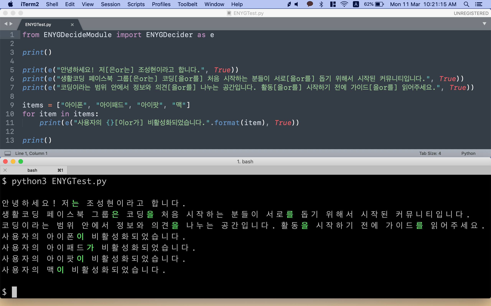
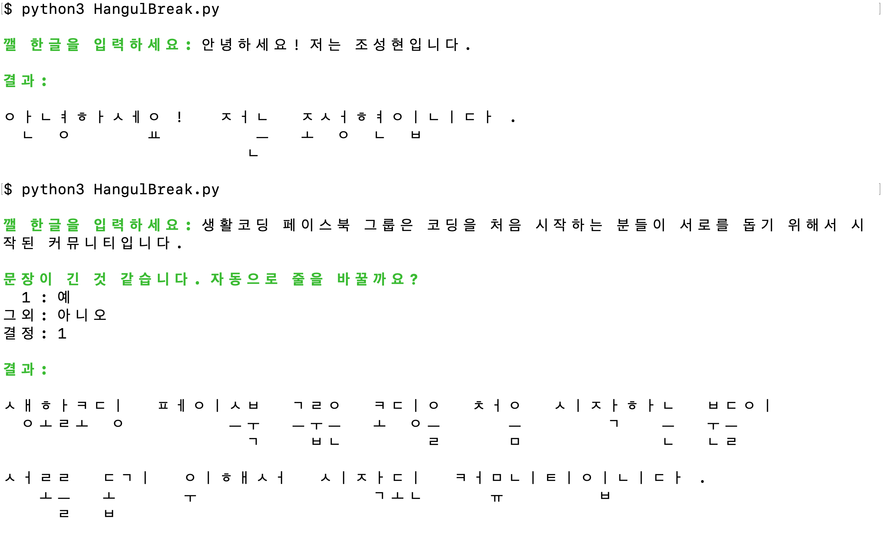
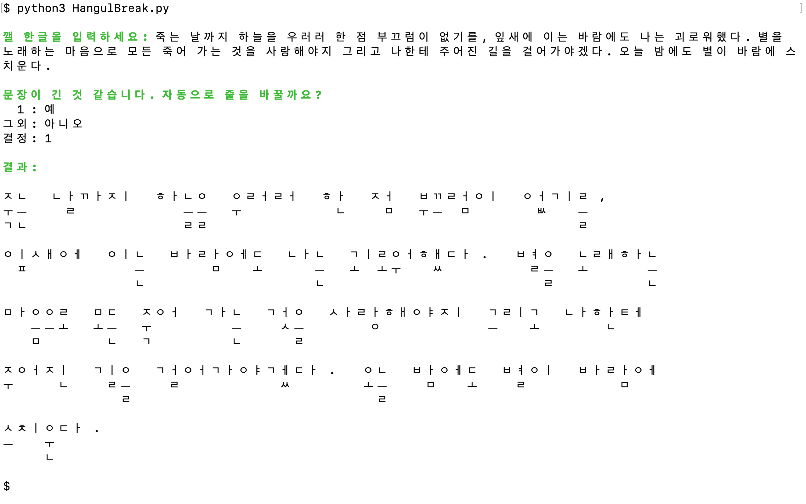

 

# 한글깨기.py & 은는이가.py

## [Read this text in English](READMEEng.md)

- [x]   [Python 3](Python)
- [ ]   Javascript

---

## [은는이가.py](https://www.facebook.com/groups/codingeverybody/permalink/2751648758208976/)

## [한글깨기.py](https://www.facebook.com/groups/codingeverybody/permalink/2725256104181575/)

