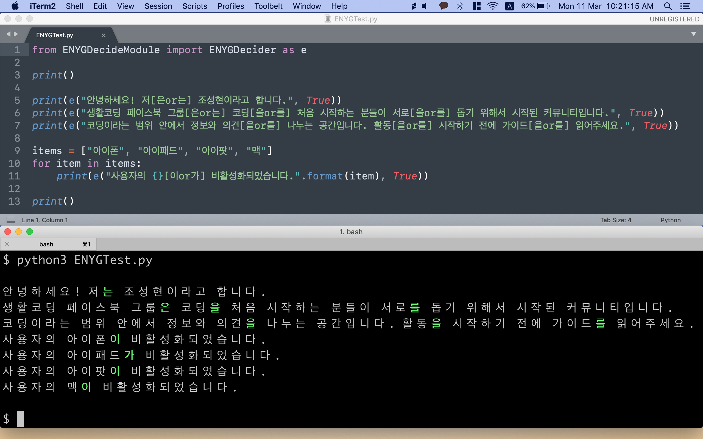
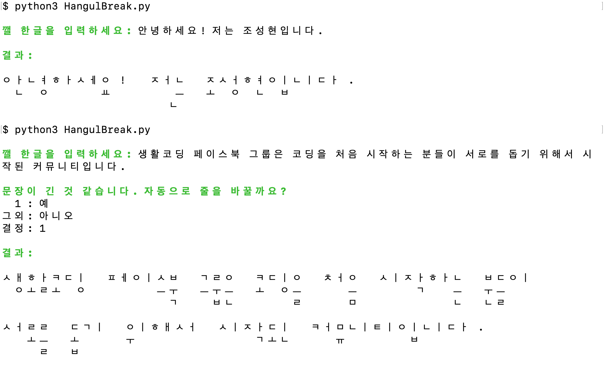
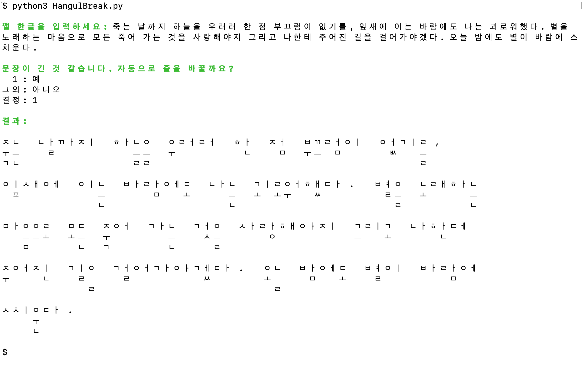

[](https://app.codacy.com/app/anaclumos/hangulbreak?utm_source=github.com&utm_medium=referral&utm_content=anaclumos/hangulbreak&utm_campaign=Badge_Grade_Dashboard) [](http://hits.dwyl.io/anaclumos/hangulbreak)

# HangulBreak.py & ENYG.py

* [Python 3](Python)
* Javascript (To be added!)

- - -

* [FB Post for HangulBreak](https://www.facebook.com/groups/codingeverybody/permalink/2725256104181575/)
* [FB Post for ENYG.py](https://www.facebook.com/groups/codingeverybody/permalink/2751648758208976/)

Hangul, the Korean Alphabet, can be decomposed into several components. For example, `컴퓨터`, meaning `Computer`, can be decomposed into `ㅋㅓㅁㅍㅠㅌㅓ`. While there are structural benefits if we can easily decompose Hangul, there are limited resources providing this functionalities. I have created my own module, and open sourced here.

## ENYG.py

In Korean, we have a suffix that elaborates the grammatical relationships between each words. This suffix varies according to the previous character's composition (을 or 를, 이 or 가, 은 or 는...). Most of the codes we use simply write two suffix at the same time, in order to reduce workload.

For example, "a" and "an" is conditionally switched according to the following word in English. We can analyze the following word to decide whether 'a' or 'an' fits in the place. But current Korean Hangul libraries are just writing both of them, like the following.

```
I like a(an) apple.
```
Yes, it does the job, but it is aesthetically not pleasing and even confusing sometimes... The same thing was happening in Korean Hangul Libraries.

ENYG.py is designed to fix this issue. It analyzes the sentence to decide the suffix of each words.



## HangulBreak.py

This is a decomposing library of Hangul. Unlike other hangul decomposition library, this returns individual character sets for each letter, for greater compatibility. ENYG.py is built using this library.


